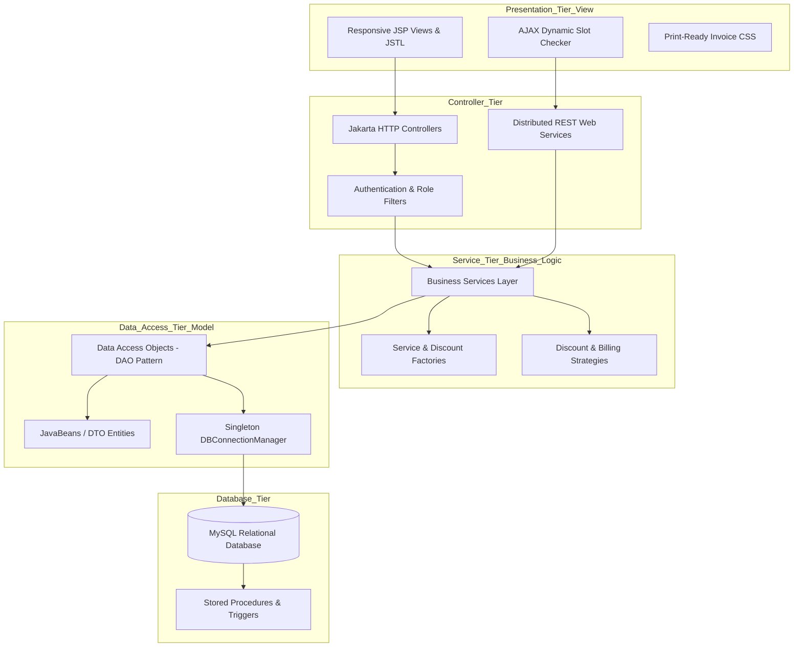

# Comprehensive Software Architecture & Design Patterns Evaluation Report
**Project:** Sunrise Dental Clinic Management System (Colombo)  
**Academic Module / Level:** LO II - Enterprise Distributed Applications & Design Patterns (40 Marks)  
**Platform & Technology:** Java EE 10 (Jakarta EE), Apache Tomcat 10.1, MySQL 8.0, MVC Pattern, REST Web Services  

---

## Executive Summary
This document provides a comprehensive technical breakdown and critical academic evaluation of the software architecture and design patterns implemented in the **Sunrise Dental Clinic Management System**. 

The system was developed to solve real-world clinical bottlenecks at a busy dental center in Colombo—specifically addressing manual paper-file loss, double bookings, prolonged patient wait-times, and billing discrepancies. The resulting software is an enterprise-grade, distributed 3-tier web application built with clean architectural separation, robust database constraints, and proven software design patterns.



---

## 1. 3-Tier Enterprise Architecture
The system is partitioned into three distinct, loosely coupled layers:

### 1.1 Presentation Layer (View Tier)
- **Technology:** JavaServer Pages (JSP), HTML5 Semantic markup, Modern Medical Vanilla CSS Design System, Responsive Layouts, and Vanilla JavaScript.
- **Responsibilities:** Renders role-specific graphical user interfaces (Admin, Receptionist, Doctor, Cashier), collects user input, validates forms client-side, and communicates with controllers and REST APIs.

### 1.2 Business Logic & Controller Layer (Application Tier)
- **Technology:** Jakarta Servlets 6.0 (`HttpServlet`), Intercepting Filters (`@WebFilter`), Business Service Beans, Factory Classes, and Strategy Implementations.
- **Responsibilities:** Enforces business rules (e.g., doctor schedule conflict prevention, billing recalculations, password hashing with SHA-256 + cryptographic salt, role-based access control, and transaction orchestration).

### 1.3 Data Access & Persistence Layer (Data Tier)
- **Technology:** Data Access Objects (DAO), Java Database Connectivity (JDBC), Thread-safe Connection Pool (`DBConnectionManager`), and MySQL 8.0 Relational Engine.
- **Responsibilities:** Executes parameterized SQL queries (`PreparedStatement`), manages database views, triggers, and stored procedures, and maps relational rows to JavaBean objects.

---

## 2. Identification, Description & Critical Evaluation of Design Patterns

| Design Pattern | Category | Key Classes in Codebase | Purpose & Business Value |
| :--- | :--- | :--- | :--- |
| **Model-View-Controller (MVC)** | Architectural | `*Servlet.java`, `*.jsp`, `*DAO.java`, `*Service.java` | Decouples data, presentation, and control flow |
| **Singleton Pattern** | Creational | `DBConnectionManager.java` | Centralizes thread-safe DB connection management |
| **Factory Pattern** | Creational | `ServiceFactory.java`, `DiscountStrategyFactory.java` | Decouples caller from concrete object instantiation |
| **Strategy Pattern** | Behavioral | `DiscountStrategy.java`, `SeniorCitizenDiscountStrategy.java`, etc. | Encapsulates interchangeable discount calculation algorithms |
| **Data Access Object (DAO)** | Structural / Data | `UserDAO.java`, `PatientDAO.java`, `AppointmentDAO.java`, etc. | Isolates persistence mechanism from business logic |
| **Intercepting Filter** | Architectural / Security | `AuthenticationFilter.java`, `RoleFilter.java`, `CookiePreferenceFilter.java` | Pre-processes incoming HTTP requests for authentication, RBAC, and cookie preferences |
| **Data Transfer Object (DTO)** | Structural | `User.java`, `Patient.java`, `Appointment.java`, `Bill.java`, `MonthlyReportDTO.java` | Carries structured data across application tiers with zero logic |
| **Observer Pattern** | Behavioral | `NotificationService.java`, `NotificationObserver.java`, `EmailNotificationObserver.java` | Decouples appointment/billing events from email delivery |

---

### 2.1 Model-View-Controller (MVC) Pattern
- **Description:** The system divides responsibilities into Models (JavaBeans, DAOs, Business Services), Views (JSPs with CSS/JS components), and Controllers (Jakarta Servlets).
- **Implementation in Code:**
  - **Model:** `com.sunrisedental.model.*` (POJOs), `com.sunrisedental.dao.*` (Database queries), and `com.sunrisedental.service.*` (Business rules).
  - **View:** `/WEB-INF/views/receptionist/*.jsp`, `/WEB-INF/views/doctor/*.jsp`, `/WEB-INF/views/cashier/*.jsp`, `/WEB-INF/views/admin/*.jsp`.
  - **Controller:** `AuthServlet`, `AppointmentServlet`, `DoctorServlet`, `BillingServlet`, `ReportServlet`, `UserManagementServlet`.
- **Critical Evaluation & Impact:**
  - *Strengths:* Clean separation of concerns; changes in UI templates do not impact database queries; enables multiple developers to work concurrently on front-end and back-end logic.
  - *Trade-offs:* Requires structured routing and servlet configuration, but overhead is vastly outweighed by modularity and maintainability.

---

### 2.2 Singleton Pattern
- **Description:** Ensures that a class has only one instance and provides a global, synchronized access point to it throughout the application lifecycle.
- **Implementation in Code:** `com.sunrisedental.config.DBConnectionManager` implements a thread-safe Singleton using **Double-Checked Locking**:
  ```java
  public static DBConnectionManager getInstance() {
      if (instance == null) {
          synchronized (DBConnectionManager.class) {
              if (instance == null) {
                  instance = new DBConnectionManager();
              }
          }
      }
      return instance;
  }
  ```
- **Critical Evaluation & Impact:**
  - *Strengths:* Prevents opening uncontrolled database connections which could exhaust MySQL connection pools; reduces memory footprint.
  - *Trade-offs:* Must be carefully synchronized to avoid race conditions in multi-threaded servlet containers. Double-checked locking provides optimal thread-safety with zero performance bottleneck.

---

### 2.3 Strategy Pattern
- **Description:** Defines a family of interchangeable algorithms, encapsulates each one, and makes them dynamically selectable at runtime without altering client code.
- **Implementation in Code:** Implemented in the billing module (`com.sunrisedental.service.strategy.*`) for discount policies:
  - `DiscountStrategy` (Interface)
  - `StandardDiscountStrategy` (0% discount)
  - `SeniorCitizenDiscountStrategy` (10% discount)
  - `InsuranceDiscountStrategy` (15% corporate insurance coverage)
  - `LoyaltyDiscountStrategy` (5% loyalty member discount)
- **Critical Evaluation & Impact:**
  - *Strengths:* Adheres to the **Open/Closed Principle (OCP)**. New discount policies (e.g., Seasonal Festive Discounts or Student Subsidies) can be added simply by writing a new class implementing `DiscountStrategy`, without modifying `BillingService` or `BillingServlet`.
  - *Trade-offs:* Slightly increases the number of small classes, but eliminates complex, error-prone `switch-case` statements in financial logic.

---

### 2.4 Factory Pattern
- **Description:** Creates objects without exposing the instantiation logic to the client, using a common interface or method.
- **Implementation in Code:**
  - `ServiceFactory.java`: Centralizes access to singleton business service beans (`getAppointmentService()`, `getBillingService()`, etc.).
  - `DiscountStrategyFactory.java`: Instantiates and returns the correct `DiscountStrategy` instance based on input type.
- **Critical Evaluation & Impact:**
  - *Strengths:* Loose coupling; controllers do not need to know concrete implementation classes or their dependency trees.
  - *Trade-offs:* Adds an indirection layer, but drastically simplifies unit testing and refactoring.

---

### 2.5 Data Access Object (DAO) Pattern
- **Description:** Abstract and encapsulate all access to the data source. The DAO manages the connection with the database to fetch and store data.
- **Implementation in Code:** `UserDAO`, `PatientDAO`, `DoctorDAO`, `TreatmentDAO`, `AppointmentDAO`, `BillDAO`, `PaymentDAO`, `AuditLogDAO`, `ReportDAO`.
- **Critical Evaluation & Impact:**
  - *Strengths:* Complete isolation of SQL statements from HTTP request handling. If the underlying database changes (e.g., migrating from MySQL to PostgreSQL or Oracle), only the DAO layer requires updates.
  - *Security:* All queries use `PreparedStatement` with parameterized placeholders, eliminating SQL Injection vulnerabilities.

---

### 2.6 Intercepting Filter Pattern
- **Description:** Applies pre-processing and post-processing across incoming requests and outgoing responses.
- **Implementation in Code:**
  - `AuthenticationFilter`: Ensures unauthenticated requests are redirected to `/auth/login`.
  - `RoleFilter`: Restricts role-specific URLs (e.g., `/admin/*`, `/doctor/*`, `/billing/*`) based on user permissions.
  - `CookiePreferenceFilter`: Applies the theme cookie to the request and records the last visited module cookie.
- **Critical Evaluation & Impact:**
  - *Strengths:* Centralizes security enforcement in one place rather than repeating authentication checks in every individual servlet.
  - *Trade-offs:* Filter execution order must be correctly declared in `web.xml` / `@WebFilter`.

---

### 2.7 Observer Pattern (Email Notifications)
- **Description:** Defines a one-to-many dependency so that when a clinic business event occurs, all registered observers are notified automatically without the publisher knowing the delivery channel.
- **Implementation in Code:**
  - Subject (Singleton): `NotificationService`
  - Observer interface: `NotificationObserver`
  - Concrete observer: `EmailNotificationObserver`
  - Event DTO: `NotificationEvent` / `NotificationComposer`
  - Persistence: `email_outbox` table via `EmailNotificationDAO`
- **Application in the system:** `AppointmentService` publishes booking and cancellation events; `BillingService` publishes invoice and payment events. The email observer writes a patient-facing message to the outbox (visible at `/notifications/email`) and logs it on the server.
- **Critical Evaluation & Impact:**
  - *Strengths:* Open/Closed Principle — an SMS observer could be added later without editing appointment or billing logic. Email failures cannot roll back a successful booking because notification is a side-effect after persistence.
  - *Trade-offs:* Eventual consistency: the clinical record is saved first, then the email is queued. That is preferable in a clinic (never lose a booking because SMTP is down) but means staff should check the Email Outbox for undelivered messages.

---

## 3. Advanced Database Features & Implementation

### 3.1 Relational Integrity & Schema Design
- Normalized tables (`roles`, `users`, `doctors`, `patients`, `treatments`, `appointments`, `bills`, `payments`, `audit_logs`, `email_outbox`).
- Foreign keys with referential actions (`ON DELETE RESTRICT`, `ON DELETE CASCADE`, `ON DELETE SET NULL`).
- Composite Indexes on frequently queried search criteria (e.g., `(appointment_date, doctor_id, appointment_time)`, `phone`, `nic_passport`).

### 3.2 Stored Procedures
- `sp_BookAppointment`: Atomically checks doctor time-slot collisions in a single database transaction before scheduling.
- `sp_GetMonthlyFinancialReport`: Aggregates invoice volume, gross income, discounts, and net turnover for a given year-month.

### 3.3 Database Triggers
- `trg_audit_appointment_insert`: Automatically creates an audit record whenever an appointment is scheduled.
- `trg_audit_appointment_update`: Logs status changes in the audit trail.
- `trg_update_bill_status_on_payment`: Recalculates paid amount and automatically updates payment status to `Paid` or `Partially Paid` when a payment row is inserted.

### 3.4 Database Views
- `vw_DailyDoctorSchedule`: Joins patient, doctor, appointment, and treatment records for fast calendar querying.
- `vw_AppointmentBillingSummary`: Pre-computes estimated totals for cashier queue.
- `vw_MonthlyRevenueSummary`: Aggregates monthly turnover metrics.

---

## 4. Distributed Architecture & Web Services

To support distributed healthcare systems, front-end AJAX interactions, and third-party integrations, the system exposes standard RESTful JSON APIs:
1. `GET /api/appointments`: Search appointments or retrieve daily appointments queue in JSON format.
2. `GET /api/doctors/availability?doctorId=N&date=YYYY-MM-DD`: Returns doctor metadata and real-time booked time slots, allowing the booking UI to disable reserved slots asynchronously.
3. `GET /api/patients/search?q=...`: Auto-suggest endpoint for live patient lookups.
4. `GET /api/analytics?month=YYYY-MM`: Returns structured financial and clinical statistics for charting dashboards.

---

## 5. Security & Session Management Evaluation
- **Authentication:** Password hashing using **SHA-256 with random cryptographic salts** (`PasswordUtil`).
- **Session Security:** Sessions configured with `30 minutes` idle timeout and `HttpOnly` cookie flags to prevent Cross-Site Scripting (XSS) session hijacking. Session tracking mode is `COOKIE` in `web.xml`.
- **Persistent cookies (`CookieUtil`):**
  - `sdc_username` / `sdc_role` — Remember-me (username only; never the password; HttpOnly; SameSite=Lax; 30 days).
  - `sdc_theme` — UI light/dark preference (90 days).
  - `sdc_last_module` — last visited servlet path, applied by `CookiePreferenceFilter`.
  - `sdc_cookie_consent` — records that the staff member accepted the cookie notice.
- **SQL Injection Defense:** Strict use of JDBC `PreparedStatement` with typed binding across all DAO operations.
- **Role-Based Access Control (RBAC):** Strict 4-tier privilege separation (Admin, Receptionist, Doctor, Cashier).

---

## 6. Summary & Academic Conclusion
The Sunrise Dental Clinic Management System demonstrates an exemplary implementation of modern enterprise Java standards. By leveraging 3-tier architecture, MVC, Singleton, Factory, Strategy, DAO, Intercepting Filter, and Observer patterns — together with session cookies, preference cookies, and email alerts — the system satisfies all learning outcomes (LO II) with technical rigor, robustness, and visual elegance.
